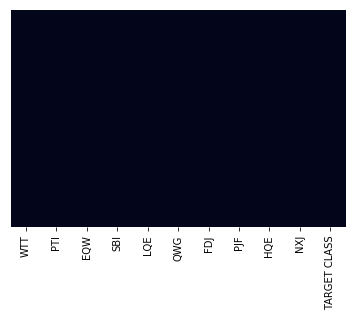
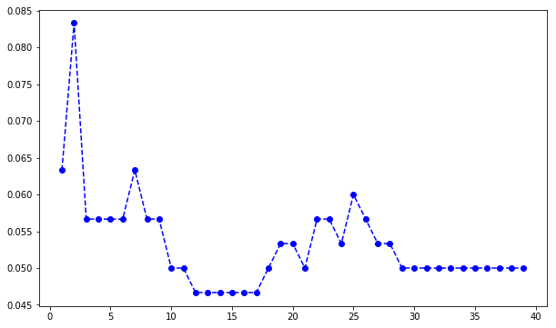

___
# <div style=font-size:huge;text-align:center;>KNN ALGORITHM.</div>
___

## About KNN classifiers.

KNN classifier predicts the class of a given test observation by identifying the observations that are nearest to it.
Becouse of this the scale of variables in such a dataset is very important.
Variables on a large scale will have a larger effect on the distance between the observations which also affects the KNN clasifier too.

An intutive way to handle the scalling problem in KNN classification is to standerdize the the dataset in such a way that all variables ae given a mean of zero and a sd of 1.
Training algorithm:

1. Store all the data

Prediction Algorithm:

1. Calculate the distance from x to all points in your data.
1. Sort the points in your data by increasing the distance from x.
1. Predict the majority label of the "k" closest points.

## About this project.

This project objects to classify the observations with respect to a target varaiable indicated at last variable.Its important to note that this one of the anonymized datasets provided by clients.This could be because of the need to protect sensitive information.


```python
import numpy as np
import pandas as pd
import matplotlib.pyplot as plt
import seaborn as sns
%matplotlib inline 
```


```python
data = pd.read_csv('annonimizeddataset',index_col = 0)
```


```python
data.head()
```


<div>
<style scoped>
    .dataframe tbody tr th:only-of-type {
        vertical-align: middle;
    }

    .dataframe tbody tr th {
        vertical-align: top;
    }

    .dataframe thead th {
        text-align: right;
    }
</style>
<table border="1" class="dataframe">
  <thead>
    <tr style="text-align: right;">
      <th></th>
      <th>WTT</th>
      <th>PTI</th>
      <th>EQW</th>
      <th>SBI</th>
      <th>LQE</th>
      <th>QWG</th>
      <th>FDJ</th>
      <th>PJF</th>
      <th>HQE</th>
      <th>NXJ</th>
      <th>TARGET CLASS</th>
    </tr>
  </thead>
  <tbody>
    <tr>
      <th>0</th>
      <td>0.913917</td>
      <td>1.162073</td>
      <td>0.567946</td>
      <td>0.755464</td>
      <td>0.780862</td>
      <td>0.352608</td>
      <td>0.759697</td>
      <td>0.643798</td>
      <td>0.879422</td>
      <td>1.231409</td>
      <td>1</td>
    </tr>
    <tr>
      <th>1</th>
      <td>0.635632</td>
      <td>1.003722</td>
      <td>0.535342</td>
      <td>0.825645</td>
      <td>0.924109</td>
      <td>0.648450</td>
      <td>0.675334</td>
      <td>1.013546</td>
      <td>0.621552</td>
      <td>1.492702</td>
      <td>0</td>
    </tr>
    <tr>
      <th>2</th>
      <td>0.721360</td>
      <td>1.201493</td>
      <td>0.921990</td>
      <td>0.855595</td>
      <td>1.526629</td>
      <td>0.720781</td>
      <td>1.626351</td>
      <td>1.154483</td>
      <td>0.957877</td>
      <td>1.285597</td>
      <td>0</td>
    </tr>
    <tr>
      <th>3</th>
      <td>1.234204</td>
      <td>1.386726</td>
      <td>0.653046</td>
      <td>0.825624</td>
      <td>1.142504</td>
      <td>0.875128</td>
      <td>1.409708</td>
      <td>1.380003</td>
      <td>1.522692</td>
      <td>1.153093</td>
      <td>1</td>
    </tr>
    <tr>
      <th>4</th>
      <td>1.279491</td>
      <td>0.949750</td>
      <td>0.627280</td>
      <td>0.668976</td>
      <td>1.232537</td>
      <td>0.703727</td>
      <td>1.115596</td>
      <td>0.646691</td>
      <td>1.463812</td>
      <td>1.419167</td>
      <td>1</td>
    </tr>
  </tbody>
</table>
</div>


So here the data is anonymized with meaningless labes as the raw labels.The last class is the target class which needs to be predicted.

## Data exploration analysis


```python
data.columns
```


    Index(['WTT', 'PTI', 'EQW', 'SBI', 'LQE', 'QWG', 'FDJ', 'PJF', 'HQE', 'NXJ',
           'TARGET CLASS'],
          dtype='object')


```python
data.shape
```


    (1000, 11)


```python
data.info()
```

    <class 'pandas.core.frame.DataFrame'>
    Int64Index: 1000 entries, 0 to 999
    Data columns (total 11 columns):
    WTT             1000 non-null float64
    PTI             1000 non-null float64
    EQW             1000 non-null float64
    SBI             1000 non-null float64
    LQE             1000 non-null float64
    QWG             1000 non-null float64
    FDJ             1000 non-null float64
    PJF             1000 non-null float64
    HQE             1000 non-null float64
    NXJ             1000 non-null float64
    TARGET CLASS    1000 non-null int64
    dtypes: float64(10), int64(1)
    memory usage: 93.8 KB


```python
sns.heatmap(data.isnull(),yticklabels=False,cbar=False)
```


    <matplotlib.axes._subplots.AxesSubplot at 0x1a25531a20>





The graph above shows clearly that there is no missing data in the set above.

## Scalling Variables.

As pointed out earlier ,scalling the variables is very important in KNN .


```python
from sklearn.preprocessing import StandardScaler
```


```python
scaler = StandardScaler()
```


```python
scaler.fit(data.drop('TARGET CLASS',axis = 1))
```


    StandardScaler(copy=True, with_mean=True, with_std=True)


```python
scaled_feat = scaler.transform(data.drop('TARGET CLASS',axis = 1))
```


```python
data_feat = pd.DataFrame(scaled_feat,columns=data.columns[:-1])
```


```python
data_feat.head()
```


<div>
<style scoped>
    .dataframe tbody tr th:only-of-type {
        vertical-align: middle;
    }

    .dataframe tbody tr th {
        vertical-align: top;
    }

    .dataframe thead th {
        text-align: right;
    }
</style>
<table border="1" class="dataframe">
  <thead>
    <tr style="text-align: right;">
      <th></th>
      <th>WTT</th>
      <th>PTI</th>
      <th>EQW</th>
      <th>SBI</th>
      <th>LQE</th>
      <th>QWG</th>
      <th>FDJ</th>
      <th>PJF</th>
      <th>HQE</th>
      <th>NXJ</th>
    </tr>
  </thead>
  <tbody>
    <tr>
      <th>0</th>
      <td>-0.123542</td>
      <td>0.185907</td>
      <td>-0.913431</td>
      <td>0.319629</td>
      <td>-1.033637</td>
      <td>-2.308375</td>
      <td>-0.798951</td>
      <td>-1.482368</td>
      <td>-0.949719</td>
      <td>-0.643314</td>
    </tr>
    <tr>
      <th>1</th>
      <td>-1.084836</td>
      <td>-0.430348</td>
      <td>-1.025313</td>
      <td>0.625388</td>
      <td>-0.444847</td>
      <td>-1.152706</td>
      <td>-1.129797</td>
      <td>-0.202240</td>
      <td>-1.828051</td>
      <td>0.636759</td>
    </tr>
    <tr>
      <th>2</th>
      <td>-0.788702</td>
      <td>0.339318</td>
      <td>0.301511</td>
      <td>0.755873</td>
      <td>2.031693</td>
      <td>-0.870156</td>
      <td>2.599818</td>
      <td>0.285707</td>
      <td>-0.682494</td>
      <td>-0.377850</td>
    </tr>
    <tr>
      <th>3</th>
      <td>0.982841</td>
      <td>1.060193</td>
      <td>-0.621399</td>
      <td>0.625299</td>
      <td>0.452820</td>
      <td>-0.267220</td>
      <td>1.750208</td>
      <td>1.066491</td>
      <td>1.241325</td>
      <td>-1.026987</td>
    </tr>
    <tr>
      <th>4</th>
      <td>1.139275</td>
      <td>-0.640392</td>
      <td>-0.709819</td>
      <td>-0.057175</td>
      <td>0.822886</td>
      <td>-0.936773</td>
      <td>0.596782</td>
      <td>-1.472352</td>
      <td>1.040772</td>
      <td>0.276510</td>
    </tr>
  </tbody>
</table>
</div>


## Splitting data into train and test split


```python
from sklearn.model_selection import train_test_split
```


```python
X = data_feat
```


```python
y = data['TARGET CLASS']
```


```python
X_train, X_test, y_train, y_test = train_test_split(X, y, test_size=0.30, random_state=42)
```

## KNN model deployment.


```python
from sklearn.neighbors import KNeighborsClassifier
```


```python
knn = KNeighborsClassifier(n_neighbors=1)
```


```python
knn.fit(X_train,y_train)
```


    KNeighborsClassifier(algorithm='auto', leaf_size=30, metric='minkowski',
               metric_params=None, n_jobs=None, n_neighbors=1, p=2,
               weights='uniform')


```python
predictions = knn.predict(X_test)
```

## Model Evaluation


```python
from sklearn.metrics import classification_report,confusion_matrix
```


```python
print(confusion_matrix(y_test,predictions))
print("___"*20)
print(classification_report(y_test,predictions))
```

    [[134   8]
     [ 11 147]]
    ____________________________________________________________
                  precision    recall  f1-score   support
    
               0       0.92      0.94      0.93       142
               1       0.95      0.93      0.94       158
    
       micro avg       0.94      0.94      0.94       300
       macro avg       0.94      0.94      0.94       300
    weighted avg       0.94      0.94      0.94       300
    


this gives an accuracy of 94%.

## Using the Elbow method in Improving the model.

This proces aims to extract more information by chosing a beter k value.The process will also try to iterate over many more different k values and plot their error rates.This will enable me to see which one has the lowest error rate.


```python
errorRate = []

for kvalue in range(1,40):
    knn = KNeighborsClassifier(n_neighbors=kvalue)
    knn.fit(X_train,y_train)
    predictions = knn.predict(X_test)
    errorRate.append(np.mean(predictions != y_test)) # average error rate
```


```python
plt.figure(figsize=(10,6))
plt.plot(range(1,40),errorRate,color = "blue",linestyle = "dashed",marker = 'o')
```


    [<matplotlib.lines.Line2D at 0x1a2528e518>]





```python
knn = KNeighborsClassifier(n_neighbors=15)
knn.fit(X_train,y_train)
print(confusion_matrix(y_test,predictions))
print("___"*20)
print(classification_report(y_test,predictions))
```


    ---------------------------------------------------------------------------

This gives a small improvement in accuracy.
